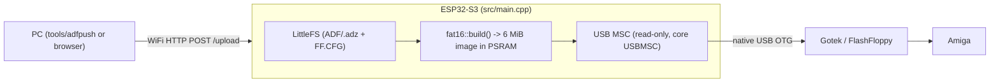

# Repository Guidelines

## Project Overview

`cursed-stick` turns an **ESP32-S3** into a WiFi-programmable, read-only USB stick for a **Gotek floppy emulator**. Amiga ADF/`.adz` files stored in on-flash **LittleFS** are assembled into a synthetic **6 MiB FAT16 image** in **PSRAM**, which is presented over the native **USB-OTG** port as a **read-only TinyUSB MSC device**. FlashFloppy reads it like an ordinary USB drive. A small WiFi HTTP server accepts uploads/deletes and re-enumerates USB so the Gotek re-scans.

Firmware (PlatformIO / Arduino) — not a host application. The only host-side code is a test harness for the FAT16 builder and a curl uploader.

## Architecture & Data Flow



Two layers:

1. **`src/main.cpp`** — firmware glue: PSRAM allocation, LittleFS mount, `ensureDefaultConfig()` (writes `/FF.CFG`), `rebuildImage()`, TinyUSB MSC callbacks, WiFi/mDNS, HTTP routes.
2. **`src/fat16.cpp` + `include/fat16.h`** — pure, host-testable FAT16 image builder with **no Arduino/ESP dependencies** (this is what makes `tools/host_check.sh` possible; keep it that way).

Mutation path (upload/delete): write to LittleFS → `tud_disconnect()` → `rebuildImage()` → `tud_connect()`. FlashFloppy only re-scans on disconnect/reconnect, so **preserve the disconnect → rebuild → re-enumerate ordering** and the settling delays. On capacity failure the just-written upload is rolled back (`LittleFS.remove`) and the image rebuilt before reconnecting — this only works if `rebuildImage()` closed its cached reader handle, so read the `g_currentFile` gotcha below before touching either path.

## Key Directories

| Path | Purpose |
|---|---|
| `src/` | Firmware sources: `main.cpp` (USB/WiFi/HTTP), `fat16.cpp` (image builder). |
| `include/` | `fat16.h` — public builder API and all FAT16 geometry constants. |
| `tools/` | Host tooling: `adfpush` (curl uploader), `host_check.sh` + `dump_image.cpp` (host FAT16 validation). |
| `.pio/` | PlatformIO build dir and resolved `libdeps` (gitignored — the only place resolved lib versions live). |
| `.vscode/` | Auto-generated PlatformIO/IntelliSense config (gitignored; do not hand-edit). |

## Development Commands

```bash
# Firmware (PlatformIO)
pio run                    # compile
pio run -t upload          # flash over the UART bridge @921600
pio device monitor         # UART log @115200 (Serial output lives here)
pio run -t erase           # full flash erase (useful before first 16 MB flash)
pio run -t size            # program size

# Host-side FAT16 validation (no hardware needed)
sudo apt-get install dosfstools mtools
tools/host_check.sh        # compiles fat16.cpp, then fsck.fat + mdir + mcopy/cmp
                           # fsck.fat lives in /usr/sbin: if it reports "command not
                           # found", prepend it — PATH="$PATH:/usr/sbin" tools/host_check.sh

# Push disk images to the device
tools/adfpush ~/amiga/adfs/Lemmings.adf            # any filename (e.g. FF.CFG too)
CURSED_HOST=cursed.local tools/adfpush ~/amiga/adfs/  # bulk *.adf/*.adz (non-recursive)
gzip -9k Lemmings.adf && tools/adfpush Lemmings.adz   # .adz fits ~2-4x more

# Offline seeding (no WiFi needed): copy files into data/, then flash the FS
pio run -t uploadfs --upload-port /dev/ttyACM0
```

## Code Conventions & Common Patterns

- **Naming**: `camelCase` functions (`rebuildImage`, `connectWiFi`), `g_` prefix for file-scope globals, `static` for internal state/helpers, `constexpr` constants scoped in `namespace fat16`. MSC callbacks are `mscRead`/`mscWrite` — the core's `USBMSC.h` reserves the names `msc_read_cb`/`msc_write_cb` for its own typedefs, so those cannot be used as function names.
- **Error handling**: boolean returns and `0` / `-1` sentinels; `setup()` is fatal-fast via `for (;;) delay(1000)` loops (never `abort()`/reboot). HTTP: `200` success, `507 "image full"` when rebuild fails, `404` text otherwise.
- **Logging**: UART only, `115200` (`ARDUINO_USB_CDC_ON_BOOT=0` makes native USB MSC-only). Use `Serial` and `FATAL:`-style prefixes.
- **Memory**: the 6 MiB `fatImage` MUST come from PSRAM — `heap_caps_malloc(fat16::TOTAL_BYTES, MALLOC_CAP_SPIRAM | MALLOC_CAP_8BIT)`. Builder workspace uses ordinary heap. All image writes are `memcpy`/`memset`; no allocation on the MSC read path.
- **Binary encoding**: explicit little-endian `put16`/`put32` helpers — do **not** introduce packed structs or raw casts (alignment/endianness).
- **FAT16 geometry is load-bearing**: constants in `include/fat16.h` mirror `mkfs.fat -F 16 -s 2`. Cluster count must stay ≥ 4085 (else it becomes FAT12) and any change MUST be re-validated with `tools/host_check.sh`. `MAX_FILES=64` caps the root-dir entries.
- **Comments**: every file opens with a one-line role summary; section block comments delimit regions.

## Important Files

- `src/main.cpp` — entry point (`setup()`/`loop()`), `HOSTNAME`, HTTP routes (`GET /` — file list with per-file delete buttons and an upload form, `POST /upload`, `POST /delete`), MSC callbacks, re-enumeration. WiFi credentials come from the gitignored `include/secrets.h`.
- `src/fat16.cpp`, `include/fat16.h` — image builder (`fat16::build()`, `fat16::FileEntry`, `fat16::FileReader`) and geometry.
- `platformio.ini` — the only build environment (`[env:esp32s3]`).
- `partitions.csv` — 16 MB layout: `nvs` 0x9000/0x5000, `app0` 0x10000/**0x600000 (6 MiB)**, `spiffs` 0x610000/**0x9F0000 (9.9375 MiB)**. The FS partition must be labelled **and** subtyped `spiffs` (that is what `LittleFS.begin()` looks for by default); only `spiffs`/`fat` are accepted subtypes by this platform's partition generator.
- `tools/adfpush`, `tools/host_check.sh`, `tools/dump_image.cpp` — host tooling.
- `README.md` — user-facing workflow, hardware notes, data-flow diagram.

## Runtime/Tooling Preferences

- **Required runtime**: PlatformIO Core (`pio`) 6.2.0, `platform = espressif32`, `framework = arduino`, `gnu++11`. Resolution is **unpinned**, so a plain `pio run` can silently pull newer packages — it currently resolves **espressif32 6.12.0 / arduino-esp32 2.0.17** (framework-arduinoespressif32 3.20017, ESP-IDF 5.5, toolchain-xtensa-esp32s3 8.4.0). Pin `platform=` if you need reproducibility. Do not introduce a different toolchain or a Node/Bun workflow.
- **Board**: `esp32-s3-devkitc-1` with `board_build.arduino.memory_type = qio_opi` (quad flash + octal PSRAM, N16R8). PSRAM is enabled *by this memory type*, not by a `-DBOARD_HAS_PSRAM` define — do not add one.
- **build_flags**: `ARDUINO_USB_MODE=0` selects **USB-OTG (TinyUSB)**; `ARDUINO_USB_MODE=1` is **Hardware CDC and JTAG** (USB-Serial-JTAG). These are easy to invert — with `=1` the native port stays the ROM CDC/JTAG and no OTG device ever enumerates. `ARDUINO_USB_CDC_ON_BOOT=0` keeps `Serial` on UART0 so the native port is MSC-only.
- **Flash size**: `board_upload.flash_size = 16MB` overrides the board JSON default (`esp32-s3-devkitc-1` describes the **N8** variant → `8MB`). It stamps the app image header (byte 3 = `size<<4 | speed`) and the esptool argument; it is **metadata only** — flash access is not gated by it, since the prebuilt bootloader has `CONFIG_ESPTOOLPY_FLASHSIZE_DETECT=1` and auto-detects the chip. Verify a rebuild shows `--flash_size 16MB`.
- **Libraries**: `lib_deps` is **empty** — no external libraries. USB MSC comes from the **arduino-esp32 core's `USBMSC`**; adding Adafruit TinyUSB back breaks the link (see Gotchas).
- **Hardware**: only ESP32-S2/S3/C6/P4 have usable USB-OTG — a classic ESP32 or ESP32-C3 will not work. ≥ 8 MB PSRAM is mandatory (the firmware halts without it). Flash the **native USB (OTG)** port only for the Gotek; `upload`/`monitor` use the UART bridge.
- **Non-N16R8 modules**: change `board_build.arduino.memory_type`, resize `partitions.csv` to the module's flash (keep the end offset at flash size), and set `board_upload.flash_size` to match (currently `16MB`).

## Testing & QA

- **No automated test framework and no CI** — there is no `test/` dir, no `pio test`/Unity/native env, and no CI config.
- **Sole automated check**: `tools/host_check.sh`. It compiles `src/fat16.cpp` + `tools/dump_image.cpp` on the host with `g++ -O2 -std=c++17 -I include`, builds a fixture image (`TurricanII.adz`, a >8.3 long filename, `short.adf`, a full 880 KiB `Disk.ADF`) and validates it with `fsck.fat -n`, `mdir` (LFN roundtrip) and `mcopy`+`cmp` (data roundtrip). Prints `ALL CHECKS PASSED` or exits 1. Requires `g++`, `dosfstools`, `mtools`; Linux-host only.
- **Required verification by change type**:
  - `include/fat16.h` / `src/fat16.cpp` → run `tools/host_check.sh` **and** `pio run`.
  - `src/main.cpp` → `pio run` at minimum; real proof requires flashing and manually exercising upload/delete + USB re-enumeration on hardware.
- **Never claim USB/WiFi/LittleFS behavior is verified** from `host_check.sh` — it never touches `main.cpp`.

## Gotchas & Non-Obvious Constraints

- **USB MSC uses the core's `USBMSC`** (`cores/esp32/USBMSC.h`), configured as `vendorID/productID/productRevision` + `onRead`/`onWrite` + `mediaPresent(true)` + `begin(blockCount, 512)`, started by `USB.begin()`. Its callbacks are 4-arg: `int32_t (*)(uint32_t lba, uint32_t offset, void* buffer, uint32_t bufsize)` — compute the byte offset as `lba * 512 + offset`. Re-enumeration (so FlashFloppy re-scans) uses TinyUSB's `tud_disconnect()`/`tud_connect()` from `tusb.h`.
- **Adafruit TinyUSB Library is incompatible with this framework**: its ESP32 port defers init to the core (`TinyUSB_Port_InitDevice` is a no-op) yet ships its own copy of TinyUSB, which duplicate-symbols the core's `libarduino_tinyusb.a` as soon as the core's USB stack is linked. Do not add it back or call its API.
- **Read-only by design**: `mscWrite` returns `-1`. Do not add write support casually.
- **The volume MUST advertise write-protect** — this is what makes FlashFloppy take its read-only code path at all. `tud_msc_is_writable_cb()` returns `false`, overriding TinyUSB's weak default; TinyUSB builds the MSC MODE SENSE write-protect bit from it, and FlashFloppy derives `USBH_MSC_Param.MSWriteProtect` → `usbh_msc_readonly()` → `volume_readonly()` from that bit. Note the attribute comes from the *header* declaration (`TU_ATTR_WEAK`), so our definition also links as `W` — verify the body is ours, not the library's `return true`: `xtensa-esp32s3-elf-objdump -d --disassemble=tud_msc_is_writable_cb firmware.elf` must show `movi.n a2, 0`. Without this the Gotek believes the stick is writable, tries to persist `IMAGE_A.CFG`, and gets I/O errors.
- **`IMAGE_A.CFG` must be present on the stick** (empty is fine) — the non-obvious consequence of being read-only. FlashFloppy opens it `FA_READ|FA_WRITE|FA_OPEN_ALWAYS`, but on a read-only volume `src/fs.c: mask_mode()` strips the mode to `FA_READ`, so a *missing* file makes `F_open()` fail with `FR_NO_FILE`; `handle_errors()` treats that as fatal and the Gotek shows **`*FATFS* 04`** (display format is `*FATFS* %02u` over the FRESULT, `src/main.c`). A writable stick gets this file created by the Gotek itself — which is why the owner's known-good stick has one. `ensureImageACfg()` ships it, in the same folder as `FF.CFG` (`f_chdir("FF")` selects the folder, else the root). Symptom to remember: a host that mounts and then stops after ~4 sector reads with zero writes is failing exactly here.
- **Uploader host**: `tools/adfpush` reads `CURSED_HOST` (default `cursed.local`) and POSTs *any* filename (so `FF.CFG` works); only the directory form filters to `*.adf`/`*.adz`. There is no `GOTEK_HOST` variable. **mDNS is link-local and does NOT cross a router or VLAN**, so `cursed.local` only resolves when the PC is on the same layer-2 network as the stick; on any other network use the IP the firmware prints at boot (`CURSED_HOST=172.16.4.15 adfpush file.adf`). The script preflights the host and prints that hint rather than timing out per file. Bash caveat that bit this project: `printf '-> %s\n'` fails because the format looks like an option — use `printf '%s\n' "-> $f"`; under `set -e` the broken `printf` aborted the script *before* curl ran, so nothing was ever uploaded and the error looked unrelated.
- **WiFi modem sleep MUST stay off** (`WiFi.setSleep(false)` in `connectWiFi()`) — we are a server. With the default `WIFI_PS_MIN_MODEM` the station dozes between DTIM beacons and **misses new inbound frames** on some APs, giving a brutally asymmetric failure: the stick cannot be pinged or connected to from another subnet, and its mDNS name never appears, yet its own outbound connections and established flows work perfectly — so it reads as a VLAN/firewall fault. Observed here on a UniFi `Home-ios` network, where the stick was unreachable while `WiFiClient.connect()` *from* the stick to the same host succeeded in 7 ms. Instrument the stick's own view before blaming the network.
- **`rebuildImage()` must close the cached reader handle** (`g_currentFile` + `g_currentIndex`) when it returns. `littlefsReader()` keeps the last file open for sequential reads, and an open `File` blocks `LittleFS.remove()` of that same file. `fat16::build()` returns 0 the moment a file does not fit, so a failed build leaves the handle open on the file it last read — which silently defeats both the over-capacity rollback in `handleUploadBody()` and `/delete`. The stick then wedges: the ghost file holds the image over capacity, so every later rebuild fails and every upload answers `507`, with a `FAT: build(N files) -> FAILED` at boot and files listed on the web page that nothing can clear.
- **FlashFloppy config**: `ensureDefaultConfig()` writes `/FF.CFG` at boot so a factory-fresh Gotek is configured with no hand-prepared stick. It **regenerates whenever `DEFAULT_FF_CFG` changes** — the file is recognised as ours by the `SHIPPED_MARKER` first line — while a user-uploaded `FF.CFG` (no marker) is never touched. It must sit in the image **root**; an `FF/` subfolder would *suppress* the root lookup. Shipped values mirror a known-good stick: `interface = amiga`, `display-type = auto`, `nav-mode = native`. FlashFloppy **records these into the Gotek's flash as its new defaults**, so they persist on the drive, not just the stick.
- **Unknown FF.CFG options are silently skipped** (FlashFloppy `src/config.c: get_next_opt()` does `if (!opt->name) { skip to next line; goto next_line; }`). The authoritative option list is `examples/FF.CFG`, from which `scripts/mk_config.py` generates the parser — **not** the wiki. The shipped config deliberately carries two inert lines (`chgr-pin = auto`, `disk-change-time-ms = 500`) copied verbatim from the owner's known-working stick; the real equivalent of that delay is `chgrst = delay-N` (0.5 s → `delay-1`). Do not "fix" them without checking with the owner.
- **`File::name()` is the basename; `File::path()` is the full path**: `rebuildImage()` passes `g_paths` (from `f.path()`) to `fat16::build()`, *not* `g_names` (from `f.name()`). `LittleFS.open("FF.CFG")` without a leading `/` fails with `does not start with /`, which makes `fat16::build()` return 0 and the image silently stay empty — for *any* file. This bug is invisible while LittleFS is empty and `host_check.sh` cannot catch it (it supplies its own reader).
- **Filesystem provisioning**: the firmware mounts (and formats on failure) the LittleFS partition itself, and the FAT16 image is always generated at runtime — nothing needs flash-time provisioning. `pio run -t uploadfs` **is** available (`board_build.filesystem = littlefs`) for *offline seeding* from a gitignored `data/` dir; it writes the `spiffs`-subtype partition directly at `0x610000`. Geometry must stay `block=4096 page=256` (matching `CONFIG_LITTLEFS_PAGE_SIZE=256`) or the firmware will fail to mount and **silently reformat**, wiping the seed.
- **Do not edit `.vscode/c_cpp_properties.json`** — it is auto-generated (and gitignored).
- WiFi credentials live in `include/secrets.h` (`WIFI_SSID`/`WIFI_PASS`), which is **gitignored** — keep them there, not in `main.cpp`, so they cannot be committed.
- Names are handled as **ASCII** (no UTF-8 decode); 8.3 sanitization with `STEM~N` collision suffixes plus VFAT LFN entries (names > 255 chars fail the build).
